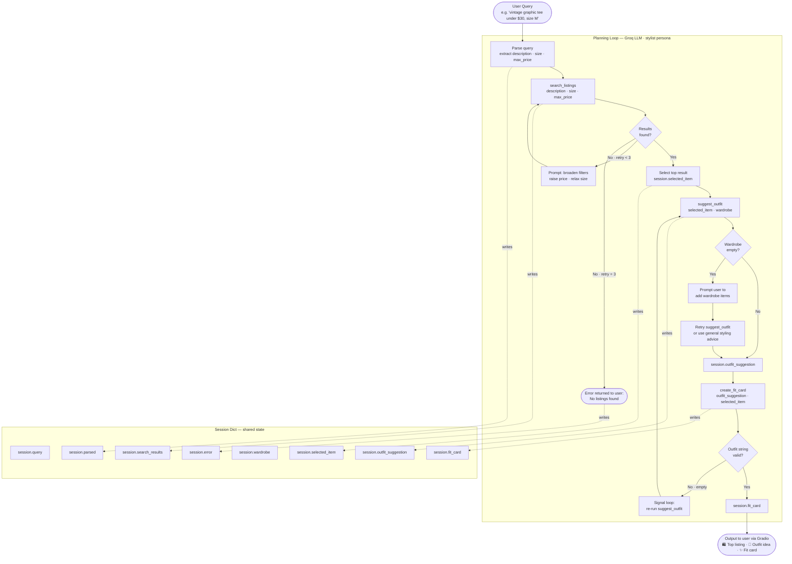

# FitFindr — planning.md

> Complete this document before writing any implementation code.
> Your spec and agent diagram are what you'll use to direct AI tools (Claude, Copilot, etc.) to generate your implementation — the more specific they are, the more useful the generated code will be.
> Your planning.md will be reviewed as part of your submission.
> Update it before starting any stretch features.

---

## Tools

List every tool your agent will use. For each tool, fill in all four fields.
You must have at least 3 tools. The three required tools are listed — add any additional tools below them.

### Tool 1: search_listings

**What it does:**
Searches the listings dataset (`data/listings.json`) for items that best match the user's request. It filters by price ceiling and size, then scores each remaining listing by keyword overlap with the user's description, returning the most relevant results first.

**Input parameters:**
- `description` (str): Natural language keywords describing the item the user wants (e.g., `"vintage graphic tee"`).
- `size` (str | None): The user's size string to filter by (e.g., `"M"`, `"W30"`), or `None` to skip size filtering. Matching is case-insensitive.
- `max_price` (float | None): The maximum acceptable price (inclusive), or `None` to skip price filtering.

**What it returns:**
A list of matching listing dicts, sorted by relevance score (highest first). Each dict contains: `id`, `title`, `description`, `category`, `style_tags`, `size`, `condition`, `price`, `colors`, `brand`, and `platform`. Returns an empty list if nothing matches — does not raise an exception.

**What happens if it fails or returns nothing:**
If no listings match, the agent prompts the user to broaden their filters — for example, raising the price ceiling or relaxing the size constraint. After three unsuccessful retries, the agent stops the loop and returns a message such as: *"No listings found matching your criteria. Please try again with different filters." *

---

### Tool 2: suggest_outfit

**What it does:**
Given the thrifted item the user is considering and their existing wardrobe, this tool suggests one to two complete outfit combinations. It explains how to style the new piece with specific items already in the wardrobe, and offers advice on achieving the intended aesthetic.

**Input parameters:**
- `new_item` (dict): The listing dict for the thrifted item the user wants to buy.
- `wardrobe` (dict): The user's current wardrobe — a dict with an `"items"` key containing a list of wardrobe item dicts. May be empty.

**What it returns:**
A non-empty string describing one or two outfit suggestions. Each suggestion names specific wardrobe pieces by their `name` field and explains the styling rationale (color harmony, silhouette balance, aesthetic cohesion, etc.).

**What happens if it fails or returns nothing:**
If `wardrobe["items"]` is empty, the agent does not raise an error. Instead, it prompts the user to add items to their wardrobe using the following fields:

```
"name":       Short description of the piece (e.g., "Baggy straight-leg jeans")
"category":   One of: tops, bottoms, outerwear, shoes, accessories
"colors":     List of colors (e.g., ["dark blue", "indigo"])
"style_tags": List of style descriptors (e.g., ["denim", "streetwear", "baggy"])
"notes":      Optional — anything unique about fit or how you style it
```

If the user declines to add wardrobe items, the tool falls back to providing general styling advice for the new item (what it pairs well with, what aesthetic it suits) rather than failing.

---

### Tool 3: create_fit_card

**What it does:**
Generates a short, shareable outfit caption in the voice of a Gen Z OOTD post — casual, specific, and platform-native. It takes the outfit suggestion and the listing details, and produces a 2–4 sentence caption suitable for Instagram or TikTok.

**Input parameters:**
- `outfit` (str): The outfit suggestion string returned by `suggest_outfit`.
- `new_item` (dict): The listing dict for the thrifted item, used to pull the item name, price, and platform.

**What it returns:**
A 2–4 sentence string written in a casual, authentic Gen Z voice. The caption mentions the item name, price, and resale platform exactly once each, and captures the outfit's specific vibe (e.g., grunge, cottagecore, Y2K streetwear).

**What happens if it fails or returns nothing:**
If `outfit` is empty or whitespace-only, this tool does not execute. It returns a descriptive error string and signals the planning loop to re-run `suggest_outfit` before retrying. If the LLM call fails due to a transient error, the agent returns: *"Fit card unavailable right now — please try again in a moment."*

---

### Additional Tools (if any)

None beyond the three required tools.

---

## Planning Loop

**How does your agent decide which tool to call next?**

The LLM is given the following system persona:

> *"You are a professional personal stylist with expertise in Gen Z streetwear, early-2000s Y2K fashion, vintage aesthetics, cottagecore, and grunge. You help users find secondhand pieces and build outfits around what they already own."*

The loop proceeds in the following order:

1. **Parse the query.** Extract `description`, `size`, and `max_price` from the user's natural language input using the LLM or regex. Store the result in `session["parsed"]`.

2. **Search for listings.** Call `search_listings(description, size, max_price)`. If the result is empty, prompt the user to broaden their filters and retry — up to a maximum of **3 iterations**. If all three attempts return nothing, set `session["error"]` and return early without calling the remaining tools.

3. **Select the top result.** Take the highest-scoring listing from `session["search_results"]` and store it in `session["selected_item"]`.

4. **Suggest an outfit.** Call `suggest_outfit(selected_item, wardrobe)`. If the wardrobe is empty, prompt the user to add items or fall back to general styling advice. Store the result in `session["outfit_suggestion"]`.

5. **Generate the fit card.** Call `create_fit_card(outfit_suggestion, selected_item)`. If the outfit string is empty, signal the loop to retry `suggest_outfit` first. Store the final caption in `session["fit_card"]`.

6. **Return the session.** The loop is done when `session["fit_card"]` is populated or `session["error"]` is set.

> **Guard rail:** The agent must only reference items from `data/listings.json` and the user's provided wardrobe or the wardrobe_schema.json. It must never invent new clothing items or add entries to either dataset.

---

## State Management

**How does information from one tool get passed to the next?**

All state is stored in a single `session` dict that is initialized at the start of each interaction and passed through the planning loop. The key fields and their lifecycle are:

| Field | Set by | Used by |
|---|---|---|
| `session["query"]` | `run_agent()` at initialization | Planning loop (query parsing) |
| `session["parsed"]` | Planning loop (step 1) | `search_listings` |
| `session["search_results"]` | `search_listings` | Planning loop (item selection) |
| `session["selected_item"]` | Planning loop (step 3) | `suggest_outfit`, `create_fit_card` |
| `session["wardrobe"]` | `run_agent()` at initialization | `suggest_outfit` |
| `session["outfit_suggestion"]` | `suggest_outfit` | `create_fit_card` |
| `session["fit_card"]` | `create_fit_card` | Final output |
| `session["error"]` | Any tool, on failure | Planning loop (early exit) |

No tool reaches into the session dict directly — the planning loop reads each field, passes the value as a function argument, and writes the return value back. This keeps the tools stateless and independently testable.

---

## Error Handling

For each tool, describe the specific failure mode you're handling and what the agent does in response.

| Tool | Failure mode | Agent response |
|------|-------------|----------------|
| `search_listings` | No results match the query | Prompt the user to raise the price ceiling or relax the size filter. Retry up to 3 times. After the third failure, set `session["error"]` to *"No listings found. Try adjusting your filters or check back later."* and stop the loop. |
| `suggest_outfit` | Wardrobe is empty | Prompt the user to add at least one wardrobe item using the schema fields (`name`, `category`, `colors`, `style_tags`, `notes`). If the user declines, fall back to general styling advice — never return an empty string. |
| `create_fit_card` | `outfit` string is empty | Skip execution. Return an error string and instruct the planning loop to re-run `suggest_outfit` before retrying this tool. |
| `create_fit_card` | `outfit` string is incomplete (whitespace-only or malformed) | Same as above — treat as empty and signal the loop to regenerate the outfit suggestion first. |

---

## Architecture



---

## AI Tool Plan

<!-- For each part of the implementation below, describe:
     - Which AI tool you plan to use (Claude, Copilot, ChatGPT, etc.)
     - What you'll give it as input (which sections of this planning.md, your agent diagram)
     - What you expect it to produce
     - How you'll verify the output matches your spec before moving on

     "I'll use AI to help me code" is not a plan.
     "I'll give Claude my Tool 1 spec (inputs, return value, failure mode) and ask it to implement
     search_listings() using load_listings() from the data loader — then test it against 3 queries
     before trusting it" is a plan. -->

I will use **Groq** (via the `groq` Python SDK) as the LLM backend for all three tools.

**Tool 1 — `search_listings`:**
I'll give groq the Tool 1 spec from this document (inputs, return value, failure mode) and ask it to implement the function using `load_listings()` from `utils/data_loader.py`. The scoring logic should compute keyword overlap between `description` and each listing's `title`, `style_tags`, and `description` fields. Before trusting the output, I'll verify that the generated code filters by all three parameters and handles the empty-results case. I'll test it against 3 queries: a query that should return results, a query filtered by size, and a query that should return nothing.

**Tool 2 — `suggest_outfit`:**
I'll give groq the Tool 2 spec and the `wardrobe_schema.json` structure, and ask it to implement the function using a Groq chat completion. I'll verify the output handles both the empty-wardrobe path (general styling advice) and the non-empty path (specific outfit combinations naming wardrobe pieces by name). I'll test it with the example wardrobe and with an empty wardrobe.

**Tool 3 — `create_fit_card`:**
I'll give groq the Tool 3 spec and ask it to write a prompt that instructs the LLM to generate a casual Gen Z caption mentioning the item name, price, and platform. I'll set a higher temperature (0.9) for variety. I'll verify the guard against an empty outfit string, then test it with two different outfits to confirm the captions feel distinct.

**Milestone 3 — Individual tool implementations:**
I used Claude (Claude Code) for all three tools. For each tool I pasted the relevant spec block from this planning.md — the function name, inputs with types, return value description, and failure mode — and asked it to implement that single function in `tools.py` using `load_listings()` from `utils/data_loader.py` where applicable. I reviewed each generated function before running it by checking: (1) do the parameter names and types match the spec exactly? (2) does the failure mode branch exist? (3) does it return the correct type? I then ran the tool in isolation with three test inputs before wiring it into the agent.

**Milestone 4 — Planning loop and state management:**
I used Claude (Claude Code) and gave it the Planning Loop section, State Management section, and the architecture diagram from this file. I asked it to implement `run_agent()` in `agent.py` following the numbered TODO steps already in the stub. Before accepting the output I checked: (1) does the loop branch on the result of `search_listings` — i.e. does it NOT call `suggest_outfit` when results are empty? (2) does every tool call read its inputs from `session` and write its output back to `session`? (3) does the no-results path set `session["error"]` and return immediately? I verified by patching `suggest_outfit` and `create_fit_card` to raise exceptions — if either was called on the no-results path, the patch would crash the test.

---

## A Complete Interaction (Step by Step)

Write out what a full user interaction looks like from start to finish — tool call by tool call. Use a specific example query.

**Example user query:** "I'm looking for a vintage graphic tee under $30. I mostly wear baggy jeans and chunky sneakers. What's out there and how would I style it?"

**Step 1: Parse the query (planning loop — no tool call)**
The planning loop uses regex to extract structured parameters from the natural language query:
- `description = "vintage graphic tee"` (keywords remaining after stripping price/size phrases)
- `max_price = 30.0` (extracted from "under $30")
- `size = None` (no size mentioned)

These are stored in `session["parsed"]`. No LLM call is made here.

**Step 2: Call `search_listings(description="vintage graphic tee", size=None, max_price=30.0)`**
The tool loads all 40 listings, filters out any priced above $30, then scores each remaining listing by counting how many of the keywords (`"vintage"`, `"graphic"`, `"tee"`) appear in the listing's title, description, style_tags, colors, and category. Listings with a score of 0 are dropped. The remaining listings are sorted by score, highest first.

Returned: a list of matching listing dicts. The top result is the **Y2K Baby Tee — Butterfly Print** (score: 3 keyword hits, price: $18, platform: depop). This list is stored in `session["search_results"]` and the top item is stored in `session["selected_item"]`.

**Step 3: Call `suggest_outfit(new_item=session["selected_item"], wardrobe=session["wardrobe"])`**
The tool checks that `wardrobe["items"]` is non-empty (the example wardrobe has 10 items). It formats the wardrobe as a bulleted list and sends a prompt to the Groq LLM (`llama-3.3-70b-versatile`) asking for 1–2 outfit combinations that pair the Y2K Baby Tee with specific named wardrobe pieces, with styling rationale for each.

Returned (stored in `session["outfit_suggestion"]`):
> "Outfit 1: Pair the Y2K Baby Tee with the Baggy straight-leg jeans and Chunky white sneakers. The dark wash jeans ground the pastel butterfly print... Outfit 2: Layer with the Vintage black denim jacket and Black combat boots for a grunge-Y2K mix..."

**Step 4: Call `create_fit_card(outfit=session["outfit_suggestion"], new_item=session["selected_item"])`**
The tool checks that `outfit` is non-empty (it is), then sends a prompt to the Groq LLM at temperature 0.9, asking for a 2–4 sentence Gen Z OOTD caption that mentions the item name, $18 price, and Depop platform once each.

Returned (stored in `session["fit_card"]`):
> "Just scored this Y2K Baby Tee — Butterfly Print for $18 on Depop and I'm obsessed. Paired it with my baggy straight-leg jeans and chunky white sneakers and the vibe is exactly what I needed."

**Final output to user:**
The Gradio UI displays three panels side by side:
- **Panel 1 (Top listing found):** Title, price ($18), platform (depop), size (S/M), condition (excellent), colors (white, pink, purple), style tags (y2k, vintage, graphic tee, cottagecore), and the seller's description.
- **Panel 2 (Outfit idea):** The full outfit suggestion naming specific wardrobe pieces and explaining color harmony and silhouette balance.
- **Panel 3 (Your fit card):** The 2–4 sentence caption ready to copy and post.
